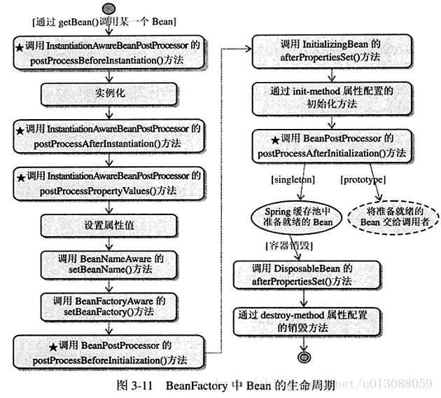
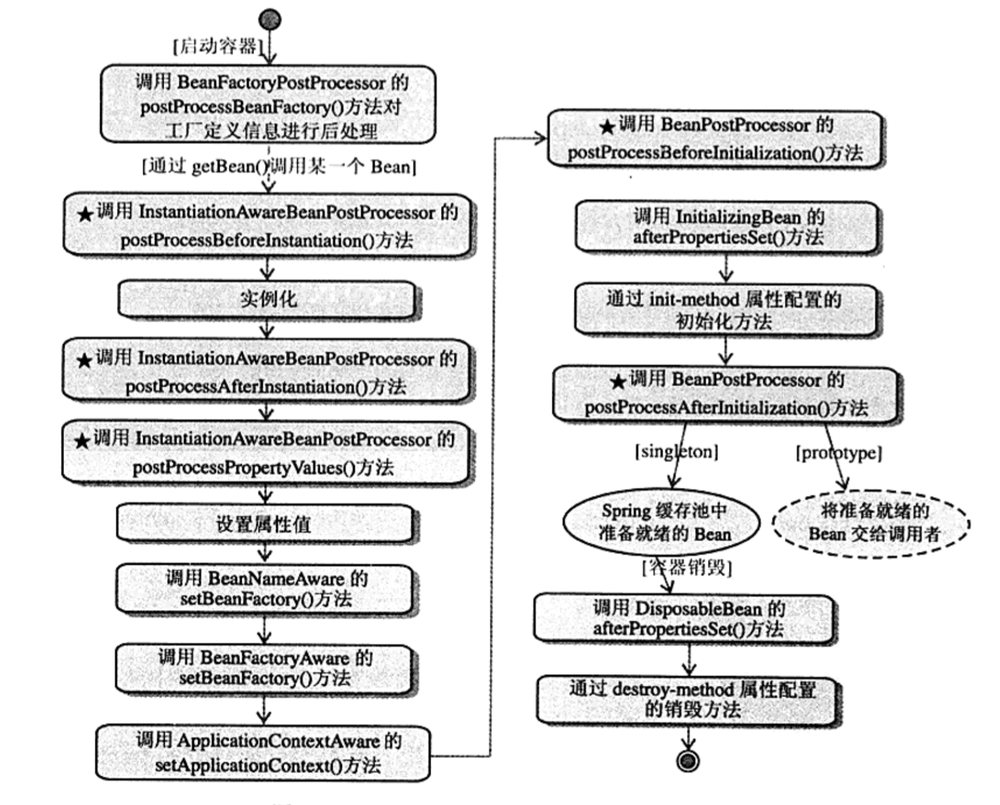

## （一）Bean的生命周期  

# BeanFactory和ApplicationContext
BeanFactory是Spring的基础，面向Spring本身。ApplicationContext是面向使用Spring的开发者。几乎所有的场合，都可以直接使用ApplicationContext。  
首先要明确的是，无论是BeanFactory还是ApplicationContext，这两个都是接口，Spring提供了多种实现。

## Bean在BeanFactory中的生命周期  
  

## Bean在ApplicationContext中的生命周期
 

Bean的生命周期，无论是在BeanFactory还是在ApplicationContext中，是非常相似的。其实单纯的就看这两张图很难真的了解发生了什么，一切还是要结合源码来看。详细一点的解读请看源码解析。在这里，我就稍微的分析一下几处地方。  

# initializeBean()
这个方法定义在AbstractAutowireCapableBeanFactory这个类中，具体源码如下：
```
protected Object initializeBean(final String beanName, final Object bean, RootBeanDefinition mbd) {
        if(System.getSecurityManager() != null) {
            AccessController.doPrivileged(new PrivilegedAction<Object>() {
                public Object run() {
                    // ==== 注释1 ==== //
                    AbstractAutowireCapableBeanFactory.this.invokeAwareMethods(beanName, bean);
                    return null;
                }
            }, this.getAccessControlContext());
        } else {
            // ==== 注释1 ==== //
            this.invokeAwareMethods(beanName, bean);
        }

        Object wrappedBean = bean;
        if(mbd == null || !mbd.isSynthetic()) {
            // ==== 注释2 ==== //
            wrappedBean = this.applyBeanPostProcessorsBeforeInitialization(bean, beanName);
        }

        try {
            // ==== 注释3 ==== //
            this.invokeInitMethods(beanName, wrappedBean, mbd);
        } catch (Throwable var6) {
            throw new BeanCreationException(mbd != null?mbd.getResourceDescription():null, beanName, "Invocation of init method failed", var6);
        }

        if(mbd == null || !mbd.isSynthetic()) {
            // ==== 注释4 ==== //
            wrappedBean = this.applyBeanPostProcessorsAfterInitialization(wrappedBean, beanName);
        }

        return wrappedBean;
    }
```
注释1对应了生命周期中的三步：
1. 调用BeanNameAware
2. 调用BeanFactoryAware
3. 调用ApplicationContextAware
具体实现稍微看一下invokeAwareMethods()这个方法就好了，很简单。源码就不在这里列出来了。

注释2对应了生命周期中的调用BeanPostProcess的postProcessBeforeInitialization()方法。  
注释4对应了生命周期中的调用BeanPostProcess的postProcessAfterInitialization()方法。  

注释3对应了生命周期中的
1. 调用InitializingBean的afterPropertiesSet()方法
2. 通过init-method属性配置的初始化方法
同上，具体实现用IDE进入这个方法的实现，一看就明白了。

# 小小的总结
这里我就分析了initializeBean这一个方法，然而这个方法就对应了这么多生命周期。但是现在的问题是，Spring是如何走到这个方法的。这就牵扯到了容器的初始化的问题，看下一篇。


